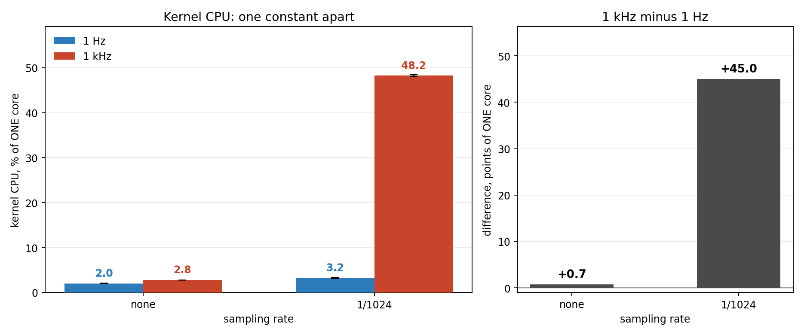

# ndtwin-analysis


Measurement tooling, figure generators, and progress-report material for **NDTwin** — a network
digital-twin kernel with a P4/bmv2 data plane. The kernel itself lives in
[NDTwin-Kernel-P4](https://github.com/Adam010341/NDTwin-Kernel-P4); this repository holds the
things built *around* it to find out what it actually does, and to say so on a slide.

## Selected figures

Five figures from the work below. Each image links to the folder that produced it, and every
number in a caption is taken from that round's report or analysis output.

[](analysis/rounds/2026-08-19_p4-sflow-accuracy/)

**The twin's rate estimate is centred on ground truth, and its scatter is sampling noise.** At
200 Mbit/s, on both the native-sFlow OVS plane and the P4/bmv2 plane (where sFlow is synthesised),
the spread narrows with window length along the sampling-theory floor 196·√(1/c), c = samples per
window: accuracy is a function of the window, not one number. —
[`2026-08-19_p4-sflow-accuracy`](analysis/rounds/2026-08-19_p4-sflow-accuracy/)

[](analysis/rounds/2026-08-21_ovs-failover-after-fix/)

**Failover on 128-host OVS: 51.8 s → 16.4 s.** After lowering Ryu's LLDP guard from 0.05 to
0.01, the outage from one link failure fell from 51.8 s (n=10) to 16.4 s (n=3), 3.1× shorter and
on par with BMv2/P4's 16.6 s. The term that moved was failure detection, 44.9 s → 11.5 s
([`ryu-topology-scaling`](analysis/rounds/2026-08-21_ryu-topology-scaling/DETECTION.md)); the
4-host case barely changed (15.7 → 15.0 s), as the mechanism predicted. —
[`2026-08-21_ovs-failover-after-fix`](analysis/rounds/2026-08-21_ovs-failover-after-fix/)

[](analysis/rounds/2026-08-31_sampling-ceiling-after-merge/)

**The traffic collapsed; the fidelity criterion read 1.01.** Sampling every packet instead of 1 in
1024 on the 128-host bmv2 fabric cut delivered traffic by 87–89% (206 → 23–26 Mbit/s), yet the
twin ÷ ground-truth ratio read 1.009–1.014 and the `SATURATED` threshold fired in 0 of 72 cells:
ground truth collapsed together with the twin. The round's headline finding is that its own
criterion measured the wrong quantity (`FINDINGS.md` F-26). —
[`2026-08-31_sampling-ceiling-after-merge`](analysis/rounds/2026-08-31_sampling-ceiling-after-merge/)

[](analysis/rounds/2026-09-02_recompute-paired-ab/)

**One constant, 45 points of a CPU core.** Two kernel builds that differ only in
`kFlowPathRecomputeInterval` (1 s vs 1 ms): with sFlow sampling at 1/1024 the 1 kHz build uses
48.2% of a core against 3.2%, a paired difference of +45.0 points (n=3, Debug build); with sampling
off the gap is +0.7. The cost is paid per flow per pass, so it only appears once samples fill the
flow table. — [`2026-09-02_recompute-paired-ab`](analysis/rounds/2026-09-02_recompute-paired-ab/)

<a href="NDTWIN%20slide%20material%20916/figures/overnight-0904/"></a>

**"succeeded" counts POSTs, not switch changes.** Twenty identical `install_flow_entry` calls raised
the API's `succeeded` counter by 20 while the switch gained one row; fifteen deletes of an entry
that never existed added 15 more and changed nothing. A real delete (the control) moves both by 1.
Found in the 2026-09-04 overnight audit and reproduced on 09-05. The fix (`succeeded` renamed
`dispatched_ok`, plus switch-side counters for what the switch accepted) was still on an
unmerged branch on 09-08 ([`FIXED-SINCE-903.md`](NDTWIN%20slide%20material%20916/FIXED-SINCE-903.md)
§3); it was merged into the kernel's trunk on 2026-09-10
([`31ae5d13`](https://github.com/Adam010341/NDTwin-Kernel-P4/commit/31ae5d13)) and reached `main`
through [PR #5](https://github.com/Adam010341/NDTwin-Kernel-P4/pull/5) on 2026-09-12. —
[`916/figures/overnight-0904`](NDTWIN%20slide%20material%20916/figures/overnight-0904/fig3_dispatch_counters_vs_switch_truth.md)

## About

Two halves, and the seam between them is the point of the repository.

| | |
|---|---|
| **`analysis/`** | The tools. Measurement drivers that ran the experiments, parsers and analysers that reduced the output, and the matplotlib scripts that rendered every figure in the decks. 10 measurement rounds, plus the literature-survey figure family and three kernel-side instruments. |
| **`NDTwin … slide material <MMDD>/`** | The reports. Four progress reports (820, 827, 903, 916): the slide template that is each one's single source of truth, the decks, the figures, and the deck generators. |

The organising rule is that **a number on a slide has to trace back to the run that produced
it.** So the plotting scripts do not transcribe values out of reports — they re-open the
archived measurement data and recompute what they draw. Several of them import their loaders
and palettes from a sibling round's script rather than restating them, so two figures standing
next to each other on a slide cannot drift apart. Where a parse is used instead of a
recomputation, the parse asserts its own yield, because a regex that silently matches nothing
renders a confident empty figure.

Three consequences worth knowing before reading anything here:

- **A figure can be right and still be unreadable.** Several scripts carry a long header
  explaining what the figure must *not* be allowed to say —
  [`plot_2x2.py`](analysis/rounds/2026-08-31_sampling-ceiling-after-merge/plot_2x2.py) refuses to
  draw its four arms on one axis because two of them ran 3.3 hours apart, and a tidy 2×2 grid
  would visually assert a comparability the data does not have.
- **Figures go stale silently.** A figure stamped "no arm has run yet" was true when rendered
  and false an hour later, and the PNG keeps rendering fine either way. That is why
  `plot_deck_903_round2.py` exists beside `plot_deck_903.py` instead of editing it.
- **Not every figure is a measurement.** The `fig4`–`fig8` family encodes a hand-coded census of
  34 published papers that measure bmv2; those are citations, not runs, and each row names its
  source. The measurement figures and the survey figures are never mixed on one axis.

## `analysis/rounds/` — the ten measurement rounds

Each directory holds that round's drivers (`*.sh`), analysers (`*.py`), figure script
(`plot_*.py`), the reduced aggregate outputs where the round produced them (`*.out`), and the
report and pre-registration documents
that state what the round was entitled to conclude.

| Round | The question | Figure script |
|---|---|---|
| `2026-08-19_p4-sflow-accuracy` | Is the ladder jitter abnormal, and does it shrink under load? | `plot_figures.py` |
| `2026-08-20_sampling-rate-and-cpu` | What does sampling cost, and where does the CPU actually go? | `plot_figures.py`, `plot_ladder_rates.py` |
| `2026-08-21_ovs-failover-after-fix` | After the fix, does the OVS scaling penalty survive? | `plot_after_fix.py` |
| `2026-08-21_ryu-topology-scaling` | Does Ryu's topology query explain the 128-host failover penalty? (No — it is link-failure detection) | `plot_budget.py` |
| `2026-08-25_sampling-rounds` | Three independent tickets: thread attribution, ladder extension, λ collapse | `plot_deck_827.py` |
| `2026-08-27_hardcoded-denominator` | Ticket Q: a hard-coded denominator, and what it did to the rates | `plot_deck_903.py`, `plot_q_by_flowcount.py` |
| `2026-08-28_QM-mirrored-block` | Six-arm mirrored block `base Q M M Q base`, so time cannot alias the treatment | `plot_deck_903_round2.py` |
| `2026-08-31_sampling-ceiling-after-merge` | Did the telemetry ceiling rise after batching and 1 kHz→1 Hz? (Not readable — 0 of 72 cells saturated) | `plot_2x2.py`, `plot_page_ceiling.py` |
| `2026-09-01_cpu-matrix-1hz` | The CPU matrix, reweighed once under the 1 Hz path | `plot_compare.py` |
| `2026-09-02_recompute-paired-ab` | Paired A/B: was that step caused by that one constant? | `plot_ab.py` |

## `analysis/study-figs/` — the bmv2 performance-study figures

`fig1`–`fig8` of the performance study, and the two scripts that build them:

- **`make_figs.py`** → `fig1` unit ambiguity · `fig2` per-flow monotonicity · `fig3` two build
  working points · `fig4` literature spread.
- **`make_survey_figs.py`** → `fig5`/`fig5b` reporting matrix (`fig5b` covers all 34 coded
  papers) · `fig6` twelve numbers on one axis · `fig7` aggregate across two planes ·
  `fig8` known-but-never-reported.

`README-generators.md` records why the two scripts are split and how `make_figs.py` came to be
version-controlled later than its own figures — the lock on the submission package was aimed at
submission *content*, never at reproducibility, and conflating the two nearly lost the
generators. `fig5b_reporting_matrix_34.md` is the coded census behind the matrix, one row per
paper with its citation.

## `analysis/kernel-tools/` — three kernel-side instruments

- **`twin_audit/`** — the twin lie detector. For every flow the twin reports as alive, go and
  check whether packets are actually moving. Built after a flow was reported "flowing at
  9–15 Mbps" with 287/288 edges up while it had carried zero packets for 291 seconds; every
  dashboard agreed, because they all descend from the same sFlow ingest. `criteria.py` answers
  "are packets moving between these two hosts?" as a **quorum over three channels that fail
  differently**, rather than one source that can be wrong in silence.
- **`make_topology.py`** — generate an OVS model with N hosts, so the all-pairs walk can be
  swept across scales. Two data points (4 hosts and 128) cannot separate a linear cost from a
  quadratic one.
- **`p4_power_helper.py`** — the privileged half of the P4 power strategy: start or stop exactly
  one named bmv2 switch from the manifest, and refuse everything else. It exists so that
  `kill` never has to go into `NOPASSWD`.

## Running the figure scripts

Most take an output directory: `python plot_figures.py <output-dir>`.

**The interpreter is part of the specification.** `make_figs.py`, `make_survey_figs.py` and
`plot_deck_903_round2.py` assert **matplotlib 3.11.x** and exit otherwise. This is not
fastidiousness: a layout defect that these scripts were fixed to avoid does not reproduce at all
on matplotlib 3.10 (it renders as 0 px instead of 11 px), so a "successful" run on the wrong
version proves nothing about the figure you are looking at. `plot_deck_903_round2.py` has an
escape hatch, `DECK_ALLOW_MPL_MISMATCH=1`, whose own error message tells you not to compare the
output against the archived figures afterwards.

The interpreter used for every archived figure is a dedicated venv (Python 3.13.13 +
matplotlib 3.11.1) that is **not in this repository** — `.plotvenv/` is ignored, since it is
rebuildable:

```bash
python3 -m venv .plotvenv && .plotvenv/bin/pip install 'matplotlib==3.11.1'
```

## What is deliberately not here

- **The raw measurement data.** Around 1.1 GB of `raw/` across these ten rounds, which stays in
  the kernel repository under `doc/audit/<round>/raw/` and its `audit-raw` ref. **47 of the 92
  scripts here name a path under `raw/`** — writing it during a run, or reading it back
  afterwards — so a clone of this repository alone will not take a round end-to-end; you need
  the matching round directory in the kernel repo. The `*.out` files that
  *are* here are the reduced aggregate outputs, so the numbers are legible without the archive.
- **Run logs** (`*.log`) — the transcripts of the runs themselves, which belong with the raw
  data rather than with the tools.
- **Session-internal notes** — handoffs, drafts, running notes, and cross-review memos. The
  pre-registrations, reports and findings are here; the scaffolding around them is not.
- **`ladder_ext.out`** — untracked in the kernel repo by commit `e6eec347`, "while it is still
  being written". An unfinished file is not a result.
- **`paper/` and `VENUES-*.md`** — the submission line, ignored here as in the kernel repo.

## Provenance

Everything under `analysis/` was taken verbatim from `NDTwin-Kernel-P4` at commit
**`d6cb0220`**, read out of the commit rather than off a working tree, and checked file by file
against that commit's blobs by sha256.

The files that differ, each deliberately:

- **`analysis/study-figs/make_figs.py` line 2**, a comment that named a submission venue, is
  replaced with a neutral description of the script. The original line is still in the kernel
  repository's history.
- **`analysis/study-figs/fig7_aggregate_two_planes.png`** is the output of the committed
  `make_survey_figs.py` (matplotlib 3.11.1), not the PNG at `d6cb0220`. That commit's PNG
  predates the script's "same UDP ladder" x-axis label (added 2026-09-01) and was identical to
  `NDTwin slide material 903/figures/_superseded/fig7_aggregate_two_planes_pre-udp-qualifier-0901.png`;
  the regenerated file is byte-identical to the current
  `NDTwin slide material 903/figures/fig7_aggregate_two_planes.png`. The other seven PNGs here
  already matched their scripts' output byte for byte.

One claim inside the archive has aged: `analysis/rounds/2026-08-28_QM-mirrored-block/FINDINGS.md`
labels `Adam010341/NDTwin-Kernel-P4` as private. That was true on 2026-08-28 and is not true now
— that repository is public. The document is left as written, because an audit record that gets
quietly edited stops being one.

Code co-developed with Claude Code is marked in-file with
`[Co-developed with claude code -- Adam]`. The tools under `analysis/` come from
NDTwin-Kernel-P4, which is licensed Apache-2.0.
