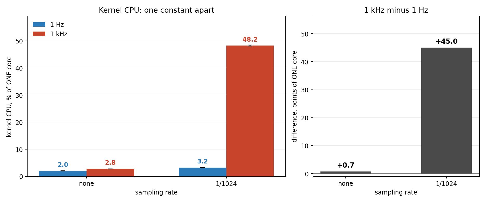

# ndtwin-analysis


Measurement tooling, figure generators, and progress-report material for **NDTwin**, a network
digital-twin kernel with a P4/bmv2 data plane. The kernel itself is in
[NDTwin-Kernel-P4](https://github.com/Adam010341/NDTwin-Kernel-P4).

## Selected figures

Each image links to the folder that produced it.

[](analysis/rounds/2026-08-19_p4-sflow-accuracy/)

**Rate estimate is centred on ground truth; the scatter is sampling noise.** At
200 Mbit/s, on both the native-sFlow OVS plane and the P4/bmv2 plane (sFlow synthesised), the
spread narrows with window length along the sampling-theory floor 196·√(1/c), c = samples per
window. See
[`2026-08-19_p4-sflow-accuracy`](analysis/rounds/2026-08-19_p4-sflow-accuracy/)

[](analysis/rounds/2026-08-21_ovs-failover-after-fix/)

**Failover on 128-host OVS: 51.8 s → 16.4 s.** After lowering Ryu's LLDP guard from 0.05 to
0.01, the outage from one link failure fell from 51.8 s (n=10) to 16.4 s (n=3), 3.1× shorter and
on par with BMv2/P4's 16.6 s. The term that moved was failure detection, 44.9 s → 11.5 s
([`ryu-topology-scaling`](analysis/rounds/2026-08-21_ryu-topology-scaling/DETECTION.md)). The
4-host case barely changed (15.7 → 15.0 s). See
[`2026-08-21_ovs-failover-after-fix`](analysis/rounds/2026-08-21_ovs-failover-after-fix/)

[](analysis/rounds/2026-08-31_sampling-ceiling-after-merge/)

**The traffic collapsed; the fidelity criterion read 1.01.** Sampling every packet instead of 1 in
1024 on the 128-host bmv2 fabric cut delivered traffic by 87–89% (206 → 23–26 Mbit/s), yet the
twin ÷ ground-truth ratio read 1.009–1.014 and the `SATURATED` threshold fired in 0 of 72 cells:
ground truth collapsed together with the twin, so the criterion measured the wrong thing
(`FINDINGS.md` F-26). See
[`2026-08-31_sampling-ceiling-after-merge`](analysis/rounds/2026-08-31_sampling-ceiling-after-merge/)

[](analysis/rounds/2026-09-02_recompute-paired-ab/)

**One constant, 45 points of a CPU core.** Two builds that differ only in
`kFlowPathRecomputeInterval` (1 s vs 1 ms): with sFlow sampling at 1/1024 the 1 kHz build uses
48.2% of a core against 3.2%, a paired difference of +45.0 points (n=3, Debug build). With
sampling off the gap is +0.7. The cost is paid per flow per pass, so it only appears once samples
fill the flow table. See [`2026-09-02_recompute-paired-ab`](analysis/rounds/2026-09-02_recompute-paired-ab/)

<a href="NDTWIN%20slide%20material%20916/figures/overnight-0904/"></a>

**The API's "succeeded" counter counts POSTs, and the switch can ignore them.** Twenty identical `install_flow_entry` calls raised
the API's `succeeded` counter by 20 while the switch gained one row; fifteen deletes of an entry
that never existed added 15 more and changed nothing. A real delete moves both by 1. Found in the
2026-09-04 overnight audit. The fix (`succeeded` renamed `dispatched_ok`, plus switch-side
counters) was merged into the kernel's trunk on 2026-09-10
([`31ae5d13`](https://github.com/Adam010341/NDTwin-Kernel-P4/commit/31ae5d13)) and reached `main`
through [PR #5](https://github.com/Adam010341/NDTwin-Kernel-P4/pull/5) on 2026-09-12. See
[`916/figures/overnight-0904`](NDTWIN%20slide%20material%20916/figures/overnight-0904/fig3_dispatch_counters_vs_switch_truth.md)

## Layout

- `analysis/`: measurement drivers, parsers, and the matplotlib scripts behind the data figures in the 820, 827 and 903 decks. 10 measurement rounds, the bmv2 performance-study figures (`fig1`-`fig8`), and three kernel-side tools. The 916 figures' scripts sit next to their figures in `916/figures/*/make_*.py`.
- Slide-material folders, one per progress report: [`NDTwin Slide material 820/`](NDTwin%20Slide%20material%20820/), [`NDTwin slide material 827/`](NDTwin%20slide%20material%20827/), [`NDTwin slide material 903/`](NDTwin%20slide%20material%20903/), [`NDTWIN slide material 916/`](NDTWIN%20slide%20material%20916/). Each has the slide template, figures and deck generators. 820, 827 and 903 also have their decks.

Most figure scripts re-open the archived data or parse the committed `*.out` files and recompute
what they draw. Some don't: 9 of the 13 figure scripts contain typed-in numbers, and
`analysis/study-figs/` transcribes values from the performance study's census table and the
rounds' `FINDINGS.md`. For example, `plot_figures.py` in the first round draws
`page37_throughput-ab.png` from five typed values (40 / 495 / 980 Mbps, 3.6k / 50.8k pps) taken
from the kernel repo's `doc/2026-08-15_bmv2-performance-report.md`. The docstring lists them.

## Measurement rounds

`analysis/rounds/`. Each directory holds some of: drivers (`*.sh`), analysers, figure scripts, reduced `*.out` files, and reports.

| Round | Question | Figure script |
|---|---|---|
| `2026-08-19_p4-sflow-accuracy` | Is the ladder jitter abnormal, and does it shrink under load? | `plot_figures.py` |
| `2026-08-20_sampling-rate-and-cpu` | What does sampling cost, and where does the CPU go? | `plot_figures.py`, `plot_ladder_rates.py` |
| `2026-08-21_ovs-failover-after-fix` | After the fix, does the OVS scaling penalty survive? | `plot_after_fix.py` |
| `2026-08-21_ryu-topology-scaling` | Does Ryu's topology query explain the 128-host failover penalty? (No, it is link-failure detection) | `plot_budget.py` |
| `2026-08-25_sampling-rounds` | Three tickets: thread attribution, ladder extension, λ collapse | `plot_deck_827.py` |
| `2026-08-27_hardcoded-denominator` | Ticket Q: a hard-coded denominator and its effect on the rates | `plot_deck_903.py`, `plot_q_by_flowcount.py` |
| `2026-08-28_QM-mirrored-block` | Six-arm mirrored block `base Q M M Q base`, so time cannot alias the treatment | `plot_deck_903_round2.py` |
| `2026-08-31_sampling-ceiling-after-merge` | Did the telemetry ceiling rise after batching and 1 kHz→1 Hz? (Unreadable, 0 of 72 cells saturated) | `plot_2x2.py`, `plot_page_ceiling.py` |
| `2026-09-01_cpu-matrix-1hz` | The CPU matrix under the 1 Hz path | `plot_compare.py` |
| `2026-09-02_recompute-paired-ab` | Paired A/B: was that step caused by that one constant? | `plot_ab.py` |

## Performance-study figures

`analysis/study-figs/` has `fig1`-`fig8`, built by two scripts:

- `make_figs.py`: `fig1` unit ambiguity, `fig2` per-flow monotonicity, `fig3` two build working points, `fig4` literature spread.
- `make_survey_figs.py`: `fig5`/`fig5b` reporting matrix (`fig5b` covers all 34 coded papers), `fig6` twelve numbers on one axis, `fig7` aggregate across two planes, `fig8` known-but-never-reported.

`fig4`, `fig5`, `fig5b`, `fig6` and `fig8` come from a hand-coded census of published bmv2
measurements, not from runs. `fig1`-`fig3` and `fig7` are my own measurements. `fig4` puts this
work's build A/B (45 vs 360 Mbit/s) next to five published numbers.

## Kernel-side tools

`analysis/kernel-tools/`:

- `twin_audit/`: for every flow the twin reports as alive, check whether packets are moving. `criteria.py` decides by quorum over three channels. Written after a flow was reported "flowing at 9-15 Mbps" while it had carried zero packets for 291 seconds.
- `make_topology.py`: generates an OVS model with N hosts, to sweep the all-pairs walk across scales.
- `p4_power_helper.py`: starts or stops exactly one named bmv2 switch from the manifest and refuses everything else, so `kill` never has to go into `NOPASSWD`.

## Running the figure scripts

Most take an output directory: `python plot_figures.py <output-dir>`. `make_figs.py`,
`make_survey_figs.py` and `plot_ab.py` write next to themselves.

`make_figs.py` and `make_survey_figs.py` assert matplotlib 3.11.x, and `plot_deck_903_round2.py`
asserts exactly 3.11.1, because its clipping fix does not reproduce on 3.10.8. I used a venv
(Python 3.13.13, matplotlib 3.11.1) that is not in the repo:

```bash
python3 -m venv .plotvenv && .plotvenv/bin/pip install 'matplotlib==3.11.1'
```

## Not included

- Raw measurement data (about 1.05 GB). It stays in the kernel repo under `doc/audit/<round>/raw/` and its `audit-raw` ref. 47 of the 92 scripts under `analysis/` refer to a path under `raw/`, so a round can't be re-run from this repo alone.
- Run logs (`*.log`), session-internal audit notes, `paper/` and `VENUES-*.md`.

## Provenance

`analysis/` was copied from `NDTwin-Kernel-P4` at commit `d6cb0220` and checked against that
commit's blobs by sha256. Three files differ: a venue-naming comment on line 2 of
`make_figs.py` was neutralised, `fig7_aggregate_two_planes.png` was regenerated from
`make_survey_figs.py`, and the docstring of `2026-08-19_p4-sflow-accuracy/plot_figures.py` now
lists its typed-in values. No code changed.

Code co-developed with Claude Code is marked in-file with
`[Co-developed with claude code -- Adam]`. The tools under `analysis/` come from
NDTwin-Kernel-P4, which is licensed Apache-2.0.
